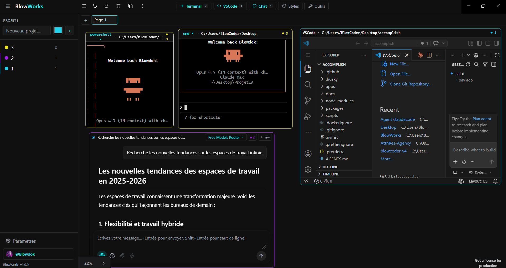

# BlowWorks



**Espace de travail infini** pour développeurs : un canvas illimité dans lequel rassembler, grouper et piloter en parallèle vos terminaux, VSCode et applications web. Adieu le jongle entre fenêtres Windows — tout votre contexte sur un plan 2D zoomable, persistant d'une session à l'autre.

> Application desktop Windows 10/11 · Electron + React 19 + tldraw · Francophone.

---

## ✨ Fonctionnalités (Version 1.0.0)

- **Canvas infini zoom/pan** basé sur tldraw : déplacez, groupez, alignez vos fenêtres librement.
- **Terminaux multiples** (PowerShell, cmd, bash, pwsh) gérés en parallèle via `node-pty` + `xterm.js`. Rendu WebGL, scrollback persistant, focus clavier automatique.
  - **Sélecteur de shell en un clic** dans l'en-tête de chaque terminal (`powershell ▾`) : switch à chaud entre PowerShell / pwsh / cmd / bash, le PTY est recréé proprement sans message d'exit parasite.
  - **Copier-coller natif** : `Ctrl+Shift+C` copie la sélection, `Ctrl+Shift+V` colle, et la sélection souris auto-copie (convention Linux/mintty). `Ctrl+C` reste le SIGINT standard du shell.
  - **Dossier de travail par défaut** : `C:\Users\Blowdok\Desktop` (configurable en v2).
- **Groupes par projet** : assignez un terminal à un projet via le bouton `○ aucun projet` du header du terminal, puis naviguez d'un groupe à l'autre via la barre latérale. **Couleur personnalisable** à la création (color picker natif à côté du nom) — elle est appliquée à la pastille, au liseré vertical de l'item de sidebar et à la bordure de chaque iframe affectée au projet, pour une identification visuelle cohérente du projet partout dans l'interface.
  - **Corridor horizontal de projets (pas de superposition)** : chaque projet possède une **zone déterministe** sur le canvas infini, dérivée de son rang dans la liste. Formule : `origin.x = rank × (gridWidth + PROJECT_CORRIDOR_GAP)` avec `gridWidth = 3 × 800 + 2 × 32 = 2464` et `PROJECT_CORRIDOR_GAP = 400`. Les projets s'enchaînent donc sur un couloir horizontal à `y = 0`, jamais l'un sur l'autre. Le clic sur le nom d'un projet appelle `slideToProject` qui anime `zoomToBounds` vers cette zone (inset 240, targetZoom 1, animation 400 ms) — d'un projet à l'autre la caméra **glisse latéralement** vers la nouvelle zone (gauche ou droite selon le rang relatif).
  - **Ranger en grille** (bouton `▦` au survol de chaque projet) : repositionne toutes les shapes portail affectées au projet sur une **grille 3 colonnes max** (remplissage gauche → droite puis ligne suivante), **uniformisées à 800×500** avec un gap de 32 px, **ancrée sur l'origine déterministe du projet** (donc à chaque rangement le projet retrouve exactement sa zone). Ordre de rangement : VSCode groupés d'abord, puis Terminal, chaque groupe trié par position visuelle (top-left → bottom-right). Toute l'opération (repositionnement + zoom) est atomique dans un `editor.run()` → **1 seul `Ctrl+Z`** annule la mise en grille. Les props métier (`projectId`, `folder`, `shell`, `cwd`) sont préservées, et les iframes VSCode / instances xterm ne sont pas rechargées (l'architecture portail stable par `shape.id` garantit la persistance même lors d'un bouleversement de positions). Module `src/renderer/src/lib/project-layout.ts`, couvert par 26 tests unitaires dont un invariant clé : **deux projets consécutifs ont des zones qui ne se chevauchent jamais** (gap ≥ `PROJECT_CORRIDOR_GAP`).
- **VSCode embarqué** : chaque dossier de projet ouvre une instance VSCode complète via `openvscode-server` (sidecar local, port fixe 27338 pour stabilité du storage).
- **Confirmation de suppression** (composant `ConfirmDialog` réutilisable, rendu via `createPortal(document.body)` pour échapper à l'héritage `pointer-events: none` du clip container des portails) : toute action destructive passe par une modale avec titre, explication des effets, bouton **Annuler** focalisé par défaut (évite l'entrée accidentelle) et bouton **Supprimer** en rouge sobre. Échap annule, clic dans l'overlay annule. Deux points d'entrée :
  - **Sidebar — bouton `×` d'un projet** : la modale rappelle que les shapes affectées redeviennent simplement « aucun projet ».
  - **Toute suppression de shape portail** (VSCode / Terminal), quel que soit le déclencheur : composant `DeleteInterceptor` monté au niveau `App` qui s'abonne via `editor.sideEffects.registerBeforeDeleteHandler('shape', …)`. Le handler retourne `false` pour annuler la suppression immédiate, accumule les shapes visées sur un `queueMicrotask` (tldraw appelle le handler 1× par shape d'un lot `deleteShapes([a, b, c])`), et ouvre **une seule modale** pour tout le lot. À la confirmation, un drapeau `bypassRef` laisse la seconde passe de `deleteShapes` passer sans interception. Couvre en un point unique tous les déclencheurs tldraw existants :
    - Touche <kbd>Delete</kbd> / <kbd>Backspace</kbd>.
    - Option « Delete » du **menu contextuel natif tldraw** (clic droit sur la shape).
    - Bouton **poubelle de la barre d'actions** tldraw flottante dans le canvas.
    - Appels programmatiques à `editor.deleteShapes(...)` depuis n'importe quel code.
      Les shapes natives tldraw (geo, arrow, note, draw, etc.) ne sont **pas** interceptées — leur suppression reste instantanée. Message de la modale adapté au contenu du lot : si au moins un terminal, rappel PTY tué + scrollback perdu + nuance `tmux`/`screen` ; si au moins une fenêtre VSCode, rappel que `openvscode-server` reste vivant. Toutes les suppressions sont annulables via <kbd>Ctrl+Z</kbd>.
- **Gestion fenêtrée des shapes portail (Terminal / VSCode)** : la shape cliquée ou sélectionnée passe automatiquement au premier plan (bring-to-front), comme une fenêtre Windows classique. Déclencheurs couverts : clic dans l'iframe, clic sur le header, clic sur la bordure tldraw, drag-select rectangulaire, changement de focus clavier. Optimisation "déjà au top" pour éviter les writes redondants au store.
  - **Aucun rechargement d'iframe lors d'un bring-to-front** : l'ordre DOM des slots portails est **stable** (trié par `shape.id` immuable) — le stacking visuel passe exclusivement par `z-index` CSS calculé depuis `shape.index` tldraw. Sans cette dissociation, Chromium détache/réattache les iframes dès qu'un nœud parent change de position dans le DOM (React reconciliation), ce qui forçait VSCode web à réinitialiser entièrement son workbench (reconnection token, extension host, grammars…) à chaque clic. Désormais, les instances VSCode et xterm survivent à tous les `bringToFront` et à tous les switch de pages tldraw.
  - **Bordure de sélection par-dessus les iframes qui chevauchent** : la bordure bleue est re-rendue **dans le stacking context** de chaque slot portail (au lieu de dépendre du SVG overlay de tldraw, qui vit sous toutes les iframes). Elle partage donc le `z-index` CSS de la shape sélectionnée et passe systématiquement au-dessus des iframes qui la traversent.
  - **Click-shield "click-to-raise" pour shapes superposées** : Chromium a un bug de hit-testing connu sur les iframes OOPIF (cross-origin, ex. VSCode) — quand deux iframes se chevauchent, le clic sur l'iframe au-dessus peut être routé vers celle en dessous (désynchronisation hit-test / z-order du compositeur). Contournement : un overlay transparent `pointer-events: auto` est rendu par-dessus CHAQUE shape portail **qui n'est pas au top** de sa page. Le premier clic est capté par le shield, la shape monte au top (`bringToFront` + select), le shield disparaît, et le clic suivant interagit normalement avec l'iframe — exactement le comportement d'une fenêtre Windows classique (1 clic activer, 2ᵉ clic interagir).
    - **`clip-path` dynamique sur le slot arrière** : pour qu'un clic sur le header de la fenêtre du dessus qui tombe sur l'iframe de la fenêtre arrière déclenche le drag tldraw (et non un ping-pong de z-index), le slot de la shape arrière reçoit un `clip-path: path(...)` calculé en rAF depuis l'union des zones non couvertes par les autres shapes portail au `z-index` supérieur. La spec CSS masking indique que `clip-path` affecte à la fois le rendu ET le hit-testing, donc les zones clippées deviennent totalement transparentes aux pointer-events — y compris le wrapper iframe / xterm (`pointer-events: auto`) qui interceptait auparavant le clic et appelait `bringToFront` sur la shape arrière. Le pointerdown descend alors jusqu'à la shape tldraw sous-jacente et le drag natif démarre, même quand la fenêtre du dessus recouvre 100 % de la zone visée. Quand une shape arrière est entièrement recouverte (`shieldRects` vide), le slot passe à `clip-path: inset(100%)` : visuellement masqué + hit-test désactivé, sans démonter l'iframe (qui reste vivante pour être restaurée au prochain bring-to-front).
- **Protection anti-crash drop d'URL exotique** : les URLs à protocole non-http(s) (ex. `claude-code://…`) sont filtrées avant que tldraw ne tente de créer un bookmark, ce qui évite à la fois la violation CSP (`connect-src`) et le `ValidationError` qui faisait crasher l'ErrorBoundary du canvas.
- **Authentification GitHub persistante (Copilot compatible)** : widget "GitHub" dans le footer de la sidebar, deux modes de connexion :
  - **Device Flow OAuth** (recommandé) : bouton "Se connecter avec GitHub" → user_code affiché + copié dans le presse-papiers + ouverture auto de github.com/login/device. Le token OAuth retourné est **accepté par Copilot** (endpoint interne `/copilot_internal/v2/token`) contrairement aux PAT classiques.
  - **PAT classique/fine-grained** : collage direct pour git + API GitHub, mais **pas Copilot**.

  Le token (OAuth ou PAT) est chiffré localement via `safeStorage` (DPAPI Windows) et propagé par deux mécanismes complémentaires :
  - Une **mini-extension VSCode** `blowworks-auth` (`resources/blowworks-auth-extension/`) installée automatiquement dans le `server-data-dir` du sidecar, qui enregistre un `AuthenticationProvider` pour l'id `github` en remplacement de l'extension native `vscode.github-authentication` (neutralisée en renommant son `package.json`, car `--disable-extension` n'est pas supporté par serve-web). L'extension lit le token depuis `pat.txt` et retourne une session valide à tout appel `vscode.authentication.getSession('github', ...)` — couvre l'UI de login, Copilot Completions et Copilot Chat dans toutes les shapes du canvas.
  - L'env var `GITHUB_TOKEN`/`GH_TOKEN` dans le sidecar, lue par `VSCODE_GIT_ASKPASS` pour les opérations git CLI (clone/push/pull sans prompt).

  Reconnexion rapide : la déconnexion est "soft" par défaut (garde le token chiffré). Un bouton "Oublier le token" est disponible pour un hard reset.

- **Persistance automatique** : layout du canvas, scrollback des terminaux, projets, paramètres — tout est sauvegardé dans une base SQLite locale et restauré au redémarrage.
- **Palette noir / gris / blanc / cyan** sobre et cohérente (pas de violet/mauve). Contraste WCAG AA sur tous les libellés (`--fg-muted: #9ca3af`).
- **Header centralisé** : la barre de pages native tldraw (Main Menu + Pages) est **déplacée via `appendChild`** dans le header pour libérer le canvas, sans casser le positionnement Radix des dropdowns. Le fond des popovers est aligné sur la sidebar (`--bg-secondary`).
- **Toggle du Style Panel tldraw** depuis le bouton `🎨 Styles` du header (approche CSS fiable car la prop `components` tldraw n'est pas réévaluée dynamiquement en v4).
- **Raccourcis clavier implémentés** :
  - `Ctrl+T` : nouveau terminal au centre du viewport
  - `Ctrl+K` : nouvelle conversation IA (ChatShape) au centre du viewport
  - `Ctrl+Shift+C` / `Ctrl+Shift+V` : copier / coller dans le terminal
  - _(à venir)_ `Ctrl+Shift+P` : palette de commandes
- **Chat IA sur le canvas (OpenRouter + Tavily)** : chaque conversation est une **ChatShape tldraw** à part entière, draggable, resizable, assignable à un projet, supprimable via la modale de confirmation — exactement le même paradigme que Terminal et VSCode.
  - **Fournisseur de modèles : OpenRouter.** Une seule clé API pour 300+ modèles (Claude, GPT, Gemini, Llama, Mistral, DeepSeek…). Sélecteur dans l'en-tête de chaque ChatShape avec **recherche fuzzy** et **métadonnées par modèle** : prix input/output par 1M tokens, fenêtre de contexte, id technique.
  - **Streaming en direct.** Le texte arrive token par token via un parseur SSE côté main qui diffuse des events IPC `ai.chunk` au renderer (même pattern que `terminal.dataEvent`). Rendu **markdown live** via `react-markdown` + `remark-gfm` (tables, task lists) + `rehype-highlight` / `highlight.js` (code blocks thème `github-dark`). Curseur clignotant en fin de ligne, auto-scroll uniquement si l'utilisateur est déjà en bas (respect de l'intention de lecture).
  - **Annulation immédiate.** Bouton "Envoyer" se transforme en "■ Stop" pendant le streaming → `AbortController` côté main, `activeControllers` indexés par `requestId`. Le message partiel déjà reçu est conservé en DB.
  - **Recherche web intégrée (Tavily).** Bouton 🌐 dans la barre d'actions : avant l'envoi au modèle, BlowWorks appelle Tavily (`search_depth: basic`, 5 résultats, `include_answer: true`) et injecte la réponse rapide + les sources formatées en markdown comme **message système additionnel**. Les URLs utilisées sont affichées sous forme de chips cliquables via le composant `CitationsList`. **Soft-fail** si la clé Tavily est absente ou en timeout : un delta informatif est émis et la réponse continue sans contexte web (mieux que bloquer).
  - **Sécurité clés API.** OpenRouter et Tavily passent **exclusivement par le process main** — la CSP du renderer (`connect-src 'self' http://127.0.0.1:* https://api.github.com`) bloque toute requête directe vers openrouter.ai/tavily.com depuis le renderer, ce qui devient une contrainte architecturale bénéfique : les clés sont chiffrées via `safeStorage` (DPAPI Windows) dans `settings.ai.openrouter.key.encrypted` et `settings.ai.tavily.key.encrypted`, et **ne touchent jamais le renderer** (ni en mémoire ni dans un store Zustand). Le renderer ne voit qu'un booléen `{ openrouter: boolean, tavily: boolean }` via `ai.getApiKeyStatus`.
  - **Persistance SQLite.** Deux nouvelles tables : `ai_conversations(id=shape.id, title, model, system, temperature, project_id, created_at, updated_at)` et `ai_messages(id, conversation_id, role, content, model, tokens_in, tokens_out, created_at)` avec `ON DELETE CASCADE` sur `conversation_id` et FK souple vers `projects` (SET NULL). L'id de la conversation est 1:1 avec `shape.id` → pas de mapping à maintenir. **Titre auto-généré** à partir du 1er message user (tronqué à 60 car sur mot entier, ellipsis si besoin).
  - **Paradigme "1 shape = 1 conversation"** : déplacer une ChatShape garde le contexte (drag accidentel ≠ perte de fil), créer une nouvelle conversation se fait via **bouton `+ new`** dans l'en-tête ou raccourci global **`Ctrl+K`**. L'ancienne conversation reste sur le canvas, éditable, supprimable. Cohérent avec le mental model Terminal/VSCode.
  - **Paramètres dédiés** (icône ⚙ dans le Header) : modale plein-écran avec sidebar d'onglets, rendue via `createPortal(document.body)` (même pattern que `ConfirmDialog`) pour échapper aux clip containers. Onglets actuels : **OpenRouter** (clé API + validation live du statut), **Recherche web · Tavily** (clé API), **Modèle par défaut** (sélecteur modèle + slider température + max tokens — utilisés par `spawnChatShape`). Onglets placeholder pour v2 : Agents, Presets, MCP.
  - **Barre d'actions complète** dans chaque ChatShape : 🌐 web, 🧠 raisonnement (toggle, actif sur modèles compatibles), 📎 upload fichier _(v2)_, ⚡ optimisation de prompt _(v2)_, sélecteur de projet (bordure colorée dès assignation).
  - **Chrome immersif & zone de saisie flottante.** Le Chat partage désormais la teinte `#101011` du canvas tldraw — plus aucune couture visible entre la ChatShape et le canvas (header, zone de messages et zone de saisie fondus dans la même surface, bordures internes invisibles, bordure externe colorée conservée uniquement quand un projet est assigné). La zone de saisie devient une **capsule flottante unifiée** : textarea en haut + barre d'actions en bas (icônes `lucide-react` : `Globe`, `Brain`, `Paperclip`, `Zap`) + bouton envoyer circulaire à droite (`ArrowUp` blanc → `Square` rouge pendant un stream), le tout dans un conteneur `#1a1a1b` arrondi 16 px avec bordure `rgba(255,255,255,0.08)` et ombre douce projetée vers le bas. La **scrollbar des messages est masquée** via la classe utilitaire `.hide-scrollbar` (scroll natif conservé : roulette, touchpad, clavier), ce qui élimine la dernière ligne visuelle entre le Chat et le canvas. Nouveau jeton CSS `--shape-surface` introduit pour matérialiser cette fusion immersive sans impacter les autres tokens (`--bg-secondary`, `--bg-tertiary`, `--border` inchangés).
  - **Immersion étendue aux shapes Terminal & VSCode.** Le même jeton `--shape-surface` pilote désormais la bordure externe des **TerminalShape** et **VSCodePortalContent** : fondue au canvas tant qu'aucun projet n'est assigné, colorée dès qu'un projet l'est. Conséquence : sur un canvas vierge ou sur des shapes « libres », les fenêtres portail paraissent flotter sans cadre, et dès qu'on assigne un projet la bordure colorée apparaît comme un marqueur d'appartenance. La bordure bleue de **sélection tldraw** n'est PAS affectée (elle continue à signaler la shape active au-dessus des iframes).
  - **Chrome de sélection contextuel — hover custom + immersion par désélection tldraw.** Hook partagé `useShapeBorderState(shapeId)` mutualisé entre **ChatShape**, **TerminalShape** et **VSCodeShape**, alimenté par un store Zustand dédié `portal-hover-store` qui tracke hover + active work DOM-side. **Raison d'être du store** : `editor.getHoveredShapeId()` tldraw ne se met PAS à jour quand la souris est au-dessus d'une iframe (l'iframe capture les pointer events avant que tldraw les voie), donc on délègue la détection à `onMouseEnter/Leave` sur le slot portail qui reçoivent les events via bubbling depuis les enfants `pointer-events: auto`.

    **La bordure de sélection + les handles de resize sont gérés 100 % par tldraw natif** (bordure bleue + handles aux coins/bords sur les shapes sélectionnées). Pas de bordure custom qui viendrait doubler l'indicateur — on laisse tldraw faire son travail et on se concentre sur les 2 signaux qu'il ne fournit pas :
    - **Hover** : `1 px rgba(255,255,255,0.10)` — fine bordure blanche signalant la présence de la shape quand la souris la survole sans l'avoir cliquée. Active sur TOUTE la surface (iframe comprise) grâce au tracking DOM.
    - **Active work — immersion par désélection** : quand l'utilisateur clique dans une zone interactive (iframe VSCode, wrapper xterm, messages/capsule Chat, boutons header), on **désélectionne tldraw** (`editor.setSelectedShapes([])`) → la bordure bleue native ET les handles de resize DISPARAISSENT. L'utilisateur travaille dans l'iframe sans aucun chrome parasite. Notre bordure de hover est également masquée (on survole forcément une shape en active work). Le retour à l'état « sélection / resize » se fait au clic sur le header de la shape.
    - **Projet assigné** : bordure colorée du projet + halo `0 0 0 2 px ${color}22`, toujours visible (signal d'appartenance projet qui reste prioritaire même en immersion).

    **3 voies de détection selon où l'utilisateur clique** :
    1. **Clic dans le header** (top 28 px — `pointer-events: none` pour laisser tldraw capturer le drag) : un listener global `window.pointerdown` (capture phase) bounds-check chaque slot portail → si zone header, `setActiveWorkShapeId(null)`. tldraw reçoit ensuite le pointerdown via le hit-testing et sélectionne la shape → bordure bleue + handles visibles.
    2. **Clic dans xterm / Chat content / boutons header** (DOM normal, `pointer-events: auto`) : même listener global → zone body → `setActiveWorkShapeId(shapeId)` + `editor.setSelectedShapes([])` → immersion activée.
    3. **Clic dans iframe VSCode** : les events ne bubble pas au parent window (frontière iframe), donc le listener global ne fire jamais. On utilise à la place le listener `window.blur` existant (qui détecte le focus de l'iframe via `document.activeElement`) → même logique : set active work + `setSelectedShapes([])`.

    **Clear automatique** sur `onMouseLeave` du slot (l'utilisateur quitte la shape → fin d'immersion) et sur clic canvas vide (aucun slot hit → clear actif). Transitions CSS 240 ms ease-out sur `border-color` + `box-shadow`.

  - **Tests unitaires** : 6 tests Tavily (format du prompt système), 4 tests `generateTitleFromFirstMessage`, 15 tests des schémas Zod IA (`AISendMessageInput`, `AIChunkEventSchema`, `AIModelSchema`, `AICreateConversationInput`, `AISetApiKeyInput`, `AIDefaultsSchema`). Total projet : **68/68 tests verts**.

## 🚧 Prévu en v2

- Intégration **CLI-Anything** pour piloter les apps natives (GIMP, Blender, Photoshop, OBS…) via leur CLI auto-générée.
- Shape iframe arbitraire (mini-navigateur pour apps web).
- Support macOS et Linux.
- Auto-update via `electron-updater`.
- **Chat IA — v2 :** upload d'images/fichiers (multimodal vision), optimisation automatique de prompt via modèle cheap (Haiku/Gemini Flash), mode thinking (`reasoning.effort`), Exa en alternative/complément de Tavily.
- **Chat IA — v3 :** générateur d'agents custom (nom, prompt système, modèle, tools), équipes d'agents, RAG local par projet via `sqlite-vec`, actions sur shapes (« explique cette sortie terminal », « revue de code sur ce VSCode »), client MCP (stdio/SSE).

---

## 🛠️ Stack technique

| Couche                  | Technologie                                                             |
| ----------------------- | ----------------------------------------------------------------------- |
| Runtime desktop         | Electron 41                                                             |
| Build & HMR             | electron-vite 5 + Vite 8                                                |
| UI                      | React 19 + TypeScript 6                                                 |
| Canvas infini           | tldraw 4 + `@tldraw/assets` (bundle Vite local, CSP-safe)               |
| Terminal                | @lydell/node-pty 1.2 + xterm.js 6 + addons fit/webgl/serialize          |
| IDE embarqué            | openvscode-server 1.96                                                  |
| Chat IA (modèles)       | OpenRouter (API OpenAI-compatible, 300+ modèles) — streaming SSE natif  |
| Chat IA (recherche web) | Tavily API (`search_depth: basic`, réponse orientée LLM)                |
| Chat IA (rendu)         | react-markdown 10 + remark-gfm 4 + rehype-highlight 7 + highlight.js 11 |
| State                   | Zustand 5                                                               |
| Persistance             | better-sqlite3 12                                                       |
| Styling                 | Tailwind CSS 4                                                          |
| Validation IPC          | Zod 4 (main/renderer uniquement, preload exclu pour sandbox)            |
| Tests                   | Vitest + Playwright                                                     |
| Packaging               | electron-builder 26 (NSIS)                                              |

---

## 📦 Installation (développement)

### Prérequis

- **Node.js ≥ 20.10** et **npm ≥ 10**
- **Windows 10 build 18309+** (support ConPTY)
- (Optionnel) Binaire `openvscode-server` pour Windows — à placer dans `resources/openvscode-server/` (voir `Intégration openvscode-server` plus bas)

> Les modules natifs `better-sqlite3` (prebuilds Electron officiels) et `node-pty` (via `@homebridge/node-pty-prebuilt-multiarch`) téléchargent leurs binaires compilés automatiquement. **Aucune installation de Visual Studio Build Tools n'est requise** sur une machine standard. Si les prebuilds ne sont pas disponibles pour votre architecture, la compilation source exige alors Python 3 + Build Tools VS 2022.

### Cloner & installer

```bash
git clone https://github.com/Blowdok/blow-works.git
cd blow-works
npm install
```

> `npm install` déclenche automatiquement `electron-builder install-app-deps` (recompile les modules natifs contre les headers Electron). Si ça échoue, lancer manuellement :
>
> ```bash
> npm run rebuild:native
> ```

### Lancer en développement

```bash
npm run dev
```

BlowWorks s'ouvre en mode HMR (main + renderer). Modifier un fichier React recharge instantanément l'UI.

### Scripts utiles

| Commande                 | Effet                                                     |
| ------------------------ | --------------------------------------------------------- |
| `npm run dev`            | Lancer l'app en mode développement                        |
| `npm run build`          | Vérifier les types + builder main/preload/renderer        |
| `npm run typecheck`      | Vérification TypeScript stricte (node + web)              |
| `npm run test`           | Tests unitaires (Vitest)                                  |
| `npm run test:e2e`       | Tests end-to-end (Playwright + Electron)                  |
| `npm run dist:win`       | Générer l'installeur NSIS `.exe` dans `dist/`             |
| `npm run rebuild:native` | Recompiler `better-sqlite3` et `node-pty` contre Electron |

---

## 📁 Structure

```
src/
├── main/               Process principal Electron (Node.js)
│   ├── index.ts        Bootstrap
│   ├── window.ts       BrowserWindow avec sandbox strict (preload CJS)
│   ├── ipc/            Handlers (project, terminal, vscode, canvas, settings)
│   └── services/       pty-manager (idempotent, exit filtering), vscode-server, db SQLite
├── preload/            Pont contextBridge (expose window.blow.*) — bundle CJS sans zod
├── renderer/           UI React + tldraw
│   └── src/
│       ├── App.tsx     Layout Header + Sidebar + Canvas
│       ├── components/ Header (Terminal/Styles/Menu tldraw), Sidebar, canvas/shapes/...
│       ├── hooks/      use-canvas-persistence, use-terminal...
│       ├── stores/     Zustand (projects, ui avec stylePanelVisible, settings)
│       └── styles/     globals.css + tokens Tailwind 4
└── shared/
    ├── ipc-channels.ts Constantes IPC (importable depuis le preload sandboxé)
    └── ipc-contract.ts Schémas Zod (main/renderer uniquement)
```

Voir `.claude/.agent/ARCHITECTURE.md` pour le kit Blowdok et les conventions.

---

## 🧩 Intégration VSCode (sidecar `serve-web`)

BlowWorks embarque l'IDE via un binaire sidecar. **Note importante** : `openvscode-server` (Gitpod) et `code-server` (Coder) ne publient plus de binaires Windows depuis 2024-2025. BlowWorks utilise donc **VSCode portable natif** : depuis fin 2024, `Code.exe serve-web` héberge un serveur équivalent à openvscode-server.

### Installation automatique (recommandée)

```bash
npm run download:vscode
```

Ce script utilise `curl.exe` (natif Windows 10+) pour télécharger VSCode portable Windows x64 (~215 Mo), l'extrait dans `resources/openvscode-server/`, puis crée le lanceur `bin/openvscode-server.cmd` qui délègue à `Code.exe serve-web`.

### Fonctionnement

Au premier usage, BlowWorks spawne le serveur sur `127.0.0.1:27338` (port **fixe**). Aucune exposition réseau externe. En production, le binaire est bundlé via `extraResources` (voir `electron-builder.yml`).

**Pourquoi un port fixe ?** L'iframe charge `http://127.0.0.1:27338/` et VSCode web stocke ses données (token GitHub, préférences workbench, extensions installées) dans localStorage et IndexedDB, scopés par origin. Un port aléatoire à chaque démarrage changerait l'origin → storage réinitialisé → re-authentification GitHub exigée à chaque session. Le port est vérifié disponible au démarrage ; si occupé par un autre processus, un message d'erreur clair s'affiche dans le shape VSCode.

**Dossier ouvert** : le chemin cible est transmis via `?folder=<uri-encoded>` où `uri-encoded = encodeURIComponent(pathToFileURL(folder))` (ex. `file:///C:/Users/.../MyProject`). VSCode parse ce paramètre via `URI.parse` (RFC 3986) — un chemin brut `C:/...` y serait mal interprété (`scheme=C`) et laisserait l'explorateur vide.

**Isolation vis-à-vis de votre VSCode installé** : le sidecar est lancé avec `--server-data-dir` pointant vers `%APPDATA%/blowworks/openvscode-server-data`. C'est l'unique flag d'isolation reconnu par `code-tunnel.exe serve-web` (les flags IDE classiques `--user-data-dir`/`--extensions-dir` sont rejetés). Cela garantit que les données serveur et extensions du sidecar restent séparées de votre VSCode principal.

**Diagnostic** : le healthcheck TCP attend jusqu'à 45 s le premier démarrage (création des caches internes). En cas d'échec, les 5 dernières lignes stderr du sidecar sont remontées dans le message d'erreur affiché dans l'iframe.

**Locale forcé `en-US`** : le workbench VSCode web lit uniquement `navigator.language` pour choisir son pack de langue (ni query param `?locale=`, ni header `Accept-Language`). Sans override, Windows francophone → `fr-FR` → pack incomplet → `Uncaught Error: !!! NLS MISSING !!!` au chargement du workbench. BlowWorks appelle donc `app.commandLine.appendSwitch('lang', 'en-US')` au bootstrap (cf. `src/main/index.ts`). tldraw reste forcé en français via `editor.user.updateUserPreferences({ locale: 'fr' })` dans `InfiniteCanvas.tsx` pour que l'UI du canvas ne bascule pas en anglais par effet de bord.

---

## 🔐 Sécurité

- `contextIsolation: true`, `nodeIntegration: false`, `sandbox: true` sur le renderer.
- **Preload sandbox-safe** : compilé en CommonJS (`out/preload/index.js`), zod inliné exclu (les sandboxés ne peuvent `require()` que les modules natifs d'Electron). Les constantes IPC vivent dans `src/shared/ipc-channels.ts` sans dépendance externe.
- CSP stricte (voir `src/renderer/index.html`) : `default-src 'self'`, `frame-src` autorise uniquement `http://127.0.0.1:*` pour openvscode-server.
- Tous les messages IPC sont **validés par Zod** côté main (`src/shared/ipc-contract.ts`).
- Le token de connexion openvscode-server est généré par `crypto.randomBytes(24)` à chaque démarrage.
- Assets tldraw servis en local via `@tldraw/assets/imports.vite` (pas de fetch CDN bloqué par la CSP).

---

## 🤝 Convention de commits

Commits en français, messages clairs. Le nom de l'outil d'assistance IA ne doit **jamais** apparaître dans les repos Blowdok sur GitHub.

---

## 📄 Licence

Privé, usage interne Blowdok. Non distribué publiquement pour l'instant.
