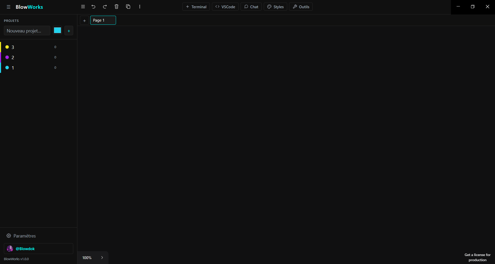

# BlowWorks

         




**🎥 Démo**

https://github.com/user-attachments/assets/d044fee7-44d3-4efe-88ea-b5a8f3a9283a

**Espace de travail infini** : un canvas illimité dans lequel rassembler, grouper et piloter en parallèle vos **terminaux, VSCode, navigateurs web et chats IA**. Adieu le jongle entre fenêtres Windows — tout votre contexte sur un plan 2D zoomable, persistant d'une session à l'autre.

> Application desktop Windows 10/11 · Electron + React 19 + tldraw · Francophone.

---

## 📑 Sommaire

- [🚀 Ce que vous pouvez faire](#-ce-que-vous-pouvez-faire)
- [👥 Pour qui ?](#-pour-qui-)
- [✨ Fonctionnalités](#-fonctionnalités)
- [🚧 Prévu en v2](#-prévu-en-v2)
- [🔧 Stack technique](#-stack-technique)
- [💾 Installer (utilisateur)](#-installer-blowworks-utilisateur)
- [📦 Installation (dév.)](#-installation-développement)
- [🔑 Configuration des clés API](#-configuration-des-clés-api)
- [📁 Structure](#-structure)
- [🧩 Intégration VSCode](#-intégration-vscode-sidecar-serve-web)
- [🔐 Sécurité](#-sécurité)
- [🐛 Bugs connus & limitations](#-bugs-connus--limitations)
- [🤝 Contribution](#-contribution)
- [📄 Licence](#-licence)

---

## 🚀 Ce que vous pouvez faire

BlowWorks réunit sur un **même canvas infini**, côte à côte et organisés par projet :

- 💻 **Des terminaux** (PowerShell, cmd, bash, pwsh) en parallèle, scrollback persistant.
- 🧩 **VSCode complet** embarqué, une instance par dossier de projet.
- 🌐 **Des navigateurs web** avec onglets, favoris, historique, extensions Chrome et sessions persistantes.
- 💬 **Des chats IA** (300+ modèles via OpenRouter : Claude, GPT, Gemini, Llama…) avec streaming, recherche web et agents configurables.
- 📝 **Un bloc-notes** et un **explorateur de fichiers** intégrés.
- 🧠 **Une mémoire long-terme** qui transforme vos conversations en base de connaissances markdown réutilisable.

Le tout **zoomable, déplaçable et persistant** d'une session à l'autre — votre contexte complet reste en place, sans jongler entre des dizaines de fenêtres.

## 👥 Pour qui ?

Pas réservé aux développeurs : un espace de travail visuel pour **quiconque jongle avec plusieurs outils à la fois**.

- **Développeurs** — un projet = un espace : VSCode + terminaux + doc/localhost dans le navigateur + un chat IA pour coder, groupés ensemble.
- **Créateurs & rédacteurs** — sources web, bloc-notes et chats IA de rédaction réunis ; la mémoire capitalise vos recherches au fil du temps.
- **Chercheurs & étudiants** — articles, notes et assistants IA rassemblés ; vos échanges deviennent automatiquement une base de connaissances.
- **Curieux & power-users de l'IA** — comparez plusieurs modèles côte à côte et gardez ChatGPT, Claude, Gemini & co à portée de clic dans un seul espace.

---

## ✨ Fonctionnalités

- **Canvas infini zoom/pan** basé sur tldraw : déplacez, groupez, alignez vos fenêtres librement.
  - **Pan universel "main / Espace" au-dessus des iframes** : quand l'outil **main** (paume) est sélectionné dans la toolbar du bas-centre OU que la touche **Espace** est maintenue, le drag panne le canvas même quand le pointeur survole une iframe VSCode (`openvscode-server`) ou un `<webview>` Electron (BrowserShape). Implémentation : le clip container des portails reçoit un attribut `data-pan-mode="true"` (piloté par `editor.getCurrentToolId() === 'hand'` + tracking espace côté window, ignoré dans inputs/textarea/contenteditable pour ne pas bloquer la frappe), et une règle CSS dans `globals.css` force `pointer-events: none !important` sur tous les descendants — y compris ceux qui ont un `pointer-events: auto` inline (header buttons, body iframe, xterm, webview). Le pointerdown traverse alors les portails jusqu'au canvas tldraw, qui pan nativement. Curseur `grab`/`grabbing` continu sur tout le canvas. Sécurité : un blur global remet le pan mode à `false` (cas Alt+Tab avec espace pressé).
- **Terminaux multiples** (PowerShell, cmd, bash, pwsh) gérés en parallèle via `node-pty` + `xterm.js`. Rendu WebGL, scrollback persistant, focus clavier automatique.
  - **Sélecteur de shell en un clic** dans l'en-tête de chaque terminal (`powershell ▾`) : switch à chaud entre PowerShell / pwsh / cmd / bash, le PTY est recréé proprement sans message d'exit parasite.
  - **Copier-coller natif** : `Ctrl+Shift+C` copie la sélection, `Ctrl+Shift+V` colle, et la sélection souris auto-copie (convention Linux/mintty). `Ctrl+C` reste le SIGINT standard du shell.
  - **Dossier de travail par défaut** : le **Bureau de l'utilisateur** par défaut (résolu côté process main), **configurable** dans Réglages > Terminal.
- **Groupes par projet** : assignez un terminal à un projet via le bouton `○ aucun projet` du header du terminal, puis naviguez d'un groupe à l'autre via la barre latérale. **Couleur personnalisable** à la création (color picker natif à côté du nom) — elle est appliquée à la pastille, au liseré vertical de l'item de sidebar et à la bordure de chaque iframe affectée au projet, pour une identification visuelle cohérente du projet partout dans l'interface.
  - **Corridor horizontal de projets (pas de superposition)** : chaque projet possède une **zone déterministe** sur le canvas infini, dérivée de son rang dans la liste. Formule : `origin.x = rank × (gridWidth + PROJECT_CORRIDOR_GAP)` avec `gridWidth = 3 × 800 + 2 × 32 = 2464` et `PROJECT_CORRIDOR_GAP = 400`. Les projets s'enchaînent donc sur un couloir horizontal à `y = 0`, jamais l'un sur l'autre. Le clic sur le nom d'un projet appelle `slideToProject` qui anime `zoomToBounds` vers cette zone (inset 240, targetZoom 1, animation 400 ms) — d'un projet à l'autre la caméra **glisse latéralement** vers la nouvelle zone (gauche ou droite selon le rang relatif).
  - **Ranger en grille** (bouton `▦` au survol de chaque projet) : repositionne toutes les shapes portail affectées au projet sur une **grille 3 colonnes max** (remplissage gauche → droite puis ligne suivante), **uniformisées à 800×500** avec un gap de 32 px, **ancrée sur l'origine déterministe du projet** (donc à chaque rangement le projet retrouve exactement sa zone). Ordre de rangement : VSCode groupés d'abord, puis Terminal, chaque groupe trié par position visuelle (top-left → bottom-right). Toute l'opération (repositionnement + zoom) est atomique dans un `editor.run()` → **1 seul `Ctrl+Z`** annule la mise en grille. Les props métier (`projectId`, `folder`, `shell`, `cwd`) sont préservées, et les iframes VSCode / instances xterm ne sont pas rechargées (l'architecture portail stable par `shape.id` garantit la persistance même lors d'un bouleversement de positions). Module `src/renderer/src/lib/project-layout.ts`, couvert par 26 tests unitaires dont un invariant clé : **deux projets consécutifs ont des zones qui ne se chevauchent jamais** (gap ≥ `PROJECT_CORRIDOR_GAP`).
- **VSCode embarqué** : chaque dossier de projet ouvre une instance VSCode complète via `openvscode-server` (sidecar local, port fixe 27338 pour stabilité du storage).
- **Confirmation de suppression** (composant `ConfirmDialog` réutilisable, rendu via `createPortal(document.body)` pour échapper à l'héritage `pointer-events: none` du clip container des portails) : toute action destructive passe par une modale avec titre, explication des effets, bouton **Annuler** focalisé par défaut (évite l'entrée accidentelle) et bouton **Supprimer** en rouge sobre. Échap annule, clic dans l'overlay annule. Deux points d'entrée :
  - **Sidebar — bouton `×` d'un projet** : la modale rappelle que les shapes affectées redeviennent simplement « aucun projet ».
  - **Toute suppression de shape portail** (VSCode / Terminal), quel que soit le déclencheur : composant `DeleteInterceptor` monté au niveau `App` qui s'abonne via `editor.sideEffects.registerBeforeDeleteHandler('shape', …)`. Le handler retourne `false` pour annuler la suppression immédiate, accumule les shapes visées sur un `queueMicrotask` (tldraw appelle le handler 1× par shape d'un lot `deleteShapes([a, b, c])`), et ouvre **une seule modale** pour tout le lot. À la confirmation, un drapeau `bypassRef` laisse la seconde passe de `deleteShapes` passer sans interception. Couvre en un point unique tous les déclencheurs tldraw existants :
    - Touche <kbd>Delete</kbd> / <kbd>Backspace</kbd>.
    - Option « Delete » du **menu contextuel natif tldraw** (clic droit sur la shape).
    - Bouton **poubelle de la barre d'actions** tldraw flottante dans le canvas.
    - Appels programmatiques à `editor.deleteShapes(...)` depuis n'importe quel code.
      Les shapes natives tldraw (geo, arrow, note, draw, etc.) ne sont **pas** interceptées — leur suppression reste instantanée. Message de la modale adapté au contenu du lot : si au moins un terminal, rappel PTY tué + scrollback perdu + nuance `tmux`/`screen` ; si au moins une fenêtre VSCode, rappel que `openvscode-server` reste vivant. Toutes les suppressions sont annulables via <kbd>Ctrl+Z</kbd>.
- **Gestion fenêtrée des shapes portail (Terminal / VSCode)** : la shape cliquée ou sélectionnée passe automatiquement au premier plan (bring-to-front), comme une fenêtre Windows classique. Déclencheurs couverts : clic dans l'iframe, clic sur le header, clic sur la bordure tldraw, drag-select rectangulaire, changement de focus clavier. Optimisation "déjà au top" pour éviter les writes redondants au store.
  - **Aucun rechargement d'iframe lors d'un bring-to-front** : l'ordre DOM des slots portails est **stable** (trié par `shape.id` immuable) — le stacking visuel passe exclusivement par `z-index` CSS calculé depuis `shape.index` tldraw. Sans cette dissociation, Chromium détache/réattache les iframes dès qu'un nœud parent change de position dans le DOM (React reconciliation), ce qui forçait VSCode web à réinitialiser entièrement son workbench (reconnection token, extension host, grammars…) à chaque clic. Désormais, les instances VSCode et xterm survivent à tous les `bringToFront` et à tous les switch de pages tldraw.
  - **Bordure de sélection par-dessus les iframes qui chevauchent** : la bordure bleue est re-rendue **dans le stacking context** de chaque slot portail (au lieu de dépendre du SVG overlay de tldraw, qui vit sous toutes les iframes). Elle partage donc le `z-index` CSS de la shape sélectionnée et passe systématiquement au-dessus des iframes qui la traversent.
  - **Click-shield "click-to-raise" pour shapes superposées** : Chromium a un bug de hit-testing connu sur les iframes OOPIF (cross-origin, ex. VSCode) — quand deux iframes se chevauchent, le clic sur l'iframe au-dessus peut être routé vers celle en dessous (désynchronisation hit-test / z-order du compositeur). Contournement : un overlay transparent `pointer-events: auto` est rendu par-dessus CHAQUE shape portail **qui n'est pas au top** de sa page. Le premier clic est capté par le shield, la shape monte au top (`bringToFront` + select), le shield disparaît, et le clic suivant interagit normalement avec l'iframe — exactement le comportement d'une fenêtre Windows classique (1 clic activer, 2ᵉ clic interagir).
    - **`clip-path` dynamique sur le slot arrière** : pour qu'un clic sur le header de la fenêtre du dessus qui tombe sur l'iframe de la fenêtre arrière déclenche le drag tldraw (et non un ping-pong de z-index), le slot de la shape arrière reçoit un `clip-path: path(...)` calculé en rAF depuis l'union des zones non couvertes par les autres shapes portail au `z-index` supérieur. La spec CSS masking indique que `clip-path` affecte à la fois le rendu ET le hit-testing, donc les zones clippées deviennent totalement transparentes aux pointer-events — y compris le wrapper iframe / xterm (`pointer-events: auto`) qui interceptait auparavant le clic et appelait `bringToFront` sur la shape arrière. Le pointerdown descend alors jusqu'à la shape tldraw sous-jacente et le drag natif démarre, même quand la fenêtre du dessus recouvre 100 % de la zone visée. Quand une shape arrière est entièrement recouverte (`shieldRects` vide), le slot passe à `clip-path: inset(100%)` : visuellement masqué + hit-test désactivé, sans démonter l'iframe (qui reste vivante pour être restaurée au prochain bring-to-front).
- **Protection anti-crash drop d'URL exotique** : les URLs à protocole non-http(s) (ex. `claude-code://…`) sont filtrées avant que tldraw ne tente de créer un bookmark, ce qui évite à la fois la violation CSP (`connect-src`) et le `ValidationError` qui faisait crasher l'ErrorBoundary du canvas.
- **Authentification GitHub persistante (Copilot compatible)** : widget "GitHub" dans le footer de la sidebar, deux modes de connexion :
  - **Device Flow OAuth** (recommandé) : bouton "Se connecter avec GitHub" → user_code affiché + copié dans le presse-papiers + ouverture auto de github.com/login/device. Le token OAuth retourné est **accepté par Copilot** (endpoint interne `/copilot_internal/v2/token`) contrairement aux PAT classiques.
  - **PAT classique/fine-grained** : collage direct pour git + API GitHub, mais **pas Copilot**.

  Le token (OAuth ou PAT) est chiffré localement via `safeStorage` (DPAPI Windows) et propagé par deux mécanismes complémentaires :
  - Une **mini-extension VSCode** `blowworks-auth` (`resources/blowworks-auth-extension/`) installée automatiquement dans le `server-data-dir` du sidecar, qui enregistre un `AuthenticationProvider` pour l'id `github` en remplacement de l'extension native `vscode.github-authentication` (neutralisée en renommant son `package.json`, car `--disable-extension` n'est pas supporté par serve-web). L'extension lit le token depuis `pat.txt` et retourne une session valide à tout appel `vscode.authentication.getSession('github', ...)` — couvre l'UI de login, Copilot Completions et Copilot Chat dans toutes les shapes du canvas.
  - L'env var `GITHUB_TOKEN`/`GH_TOKEN` dans le sidecar, lue par `VSCODE_GIT_ASKPASS` pour les opérations git CLI (clone/push/pull sans prompt).

  Reconnexion rapide : la déconnexion est "soft" par défaut (garde le token chiffré). Un bouton "Oublier le token" est disponible pour un hard reset.

- **Persistance automatique** : layout du canvas, scrollback des terminaux, projets, paramètres — tout est sauvegardé dans une base SQLite locale et restauré au redémarrage.
- **Palette noir / gris / blanc / cyan** sobre et cohérente (pas de violet/mauve). Contraste WCAG AA sur tous les libellés (`--fg-muted: #9ca3af`).
- **Header centralisé** : la barre de pages native tldraw (Main Menu + Pages) est **déplacée via `appendChild`** dans le header pour libérer le canvas, sans casser le positionnement Radix des dropdowns. Le fond des popovers est aligné sur la sidebar (`--bg-secondary`). Le Header se concentre sur les actions de **création** (Terminal / VSCode / Chat / boutons custom navigateur) — les toggles d'éléments natifs tldraw (panneau de styles, barre d'outils du bas) ont été déplacés dans la sidebar à la **section "Tools Canvas"** pour libérer de la place dans la barre du haut.
- **Boutons custom du Header (arbre récursif configurable)** : à droite des boutons système (Terminal / VSCode / Chat), une série de boutons que l'utilisateur ajoute/édite/supprime depuis **Réglages > Navigateur > "Boutons du Header"**. Chaque bouton a un libellé, une couleur (pastille avec initiale) et un **arbre d'entrées** récursif où chaque nœud est :
  - un **item** terminal `{ label, url, tagline? }` → clic = spawn `BrowserShape` ;
  - un **dossier** `{ label, children: Entry[] }` → conteneur organisationnel (pas d'URL), profondeur **illimitée**.
  
  **Affichage du bouton** : 0 entrée → désactivé, 1 entrée item → clic direct, sinon → **menu déroulant en drill-down** (clic sur un dossier → la vue actuelle est remplacée par celle de ses enfants, avec un bouton **← Retour** en haut affichant le nom du dossier courant pour remonter d'un cran ; à la racine, ← ferme le menu). Le drill-down se reset à la racine à chaque (ré)ouverture pour repartir d'un état propre. Style **identique au menu contextuel canvas** pour cohérence UX (même bouton retour, mêmes états de "vide", mêmes pastilles colorées). **Édition Settings** : arbre éditable inline avec boutons _+ Item_ et _+ Dossier_ à chaque niveau, ↑↓ pour réordonner entre frères, _↳ Déplacer…_ (sélecteur listant tous les dossiers avec indentation visuelle) pour bouger un nœud cross-parent, repli/déploiement de chaque dossier (▾/▸). **L'état replié/déplié des boutons ET de chaque dossier est persistant** : un chevron ▾/▸ devant chaque bouton (et chaque dossier) plie/déplie tout son contenu en deçà. État stocké côté store dans un Set unique (les ids `hb_*` des boutons et `hbe_*` des dossiers sont garantis distincts par les générateurs, donc pas de collision possible) et persisté dans SQLite sous la clé séparée `header.collapsedFolders` (JSON `string[]`) — découplée de `header.buttons` pour éviter de réécrire tout l'arbre à chaque toggle UI. Au prochain lancement, l'utilisateur retrouve exactement la même structure visuelle pliée/dépliée — utile quand on a beaucoup de boutons et de dossiers et qu'on veut garder le focus sur ceux qu'on est en train d'éditer. **Toute action destructive (suppression d'item, de dossier, de bouton ; restauration du preset par défaut) déclenche une `ConfirmDialog`** rendue via `createPortal(document.body)` (focus auto sur Annuler, Échap = Annuler) plutôt qu'un `window.confirm` natif — message contextuel détaillant ce qui sera perdu (ex. "ce dossier contient 7 entrées qui seront supprimées récursivement"). Garde-fou anti-cycle : déplacer un dossier dans un de ses descendants est silencieusement refusé côté store. Persistance SQLite settings clé `header.buttons` (JSON Zod validé via union récursive `z.lazy` côté `src/shared/header-buttons.ts`) ; **migration douce** ascendante du format v1 (liste plate `items`) vers v2 (arbre `entries`) — les early adopters récupèrent leur config sans intervention. Au premier lancement, seed automatique du preset **IA** historique (ChatGPT, Claude, Gemini, Perplexity, Le Chat, Grok, Copilot, DeepSeek, NotebookLM, HuggingChat) en items racine — l'utilisateur peut ensuite tout réorganiser en dossiers (_Texte_, _Image_, _Recherche_, etc.). Le menu contextuel canvas (clic droit sur le vide) propose le **même drill-down** sur tous les boutons configurés (Boutons → Dossiers → Sous-dossiers → Items, avec ← retour à chaque niveau). Concerne uniquement les raccourcis vers le navigateur web — Terminal / VSCode / Chat restent des boutons système non éditables.
- **Toggle du Style Panel tldraw** depuis le bouton `🎨 Styles` du header (approche CSS fiable car la prop `components` tldraw n'est pas réévaluée dynamiquement en v4).
- **Raccourcis clavier implémentés** :
  - `Ctrl+T` : nouveau terminal au centre du viewport
  - `Ctrl+K` : nouvelle conversation IA (ChatShape) au centre du viewport
  - `Ctrl+B` : nouveau navigateur web (BrowserShape) au centre du viewport
  - `Ctrl+Shift+C` / `Ctrl+Shift+V` : copier / coller dans le terminal
  - `Ctrl+Shift+P` : **palette de commandes** globale (création de shapes, navigation projet, toggles UI, réglages)
- **Navigateur web intégré (BrowserShape)** : mini-navigateur embarqué sur le canvas comme n'importe quelle autre shape (draggable, resizable, assignable à un projet, supprimable via la modale). Basé sur le tag **`<webview>` Electron** (et non une `<iframe>`), il n'est pas soumis aux blocages `X-Frame-Options` / CSP `frame-ancestors` — tous les sites web fonctionnent, y compris Google, GitHub, YouTube. Chaque shape possède sa propre barre de navigation (retour / avancer / recharger / URL) et toutes les BrowserShapes partagent la même session (`partition="persist:browser"`) pour conserver cookies et logins d'une shape à l'autre, isolés de l'origine du renderer principal.
  - **Recherche web via DuckDuckGo** : saisie intelligente dans la barre d'URL — un texte avec espaces ou sans point est envoyé à `duckduckgo.com/?q=…`, une URL nue (ex. `github.com/foo`) est préfixée `https://`, une URL complète est chargée telle quelle. URL persistée dans les props de la shape → chaque navigateur restaure sa dernière page au redémarrage de l'app.
  - **Liens IA routés vers le navigateur interne** : tout lien http(s) cliqué dans le **Chat** (réponses markdown), dans le **Terminal** (via `@xterm/addon-web-links`) ou dans l'**iframe VSCode** (via `setWindowOpenHandler` + `will-navigate` côté main) ouvre une nouvelle BrowserShape sur le canvas au lieu d'ouvrir le navigateur système ou d'écraser la SPA. Comportement prévisible, contexte préservé, tout reste dans BlowWorks.
  - **Bouton `Navigateur` dans le header** à côté de `Chat`, avec compteur d'instances et icône globe. Même UX que les autres boutons (Terminal / VSCode / Chat).
  - **Bouton Accueil 🏠** dans la barre de navigation : retour immédiat à la page d'accueil du moteur de recherche actif (Brave / DuckDuckGo / Google / Bing — configurable dans Settings > Navigateur). Le clic sur Accueil agit sur l'onglet courant (ne crée pas de nouvel onglet, comme Chrome).
  - **Historique global persistant** (table `browser_history` SQLite) : chaque `did-navigate` du webview alimente l'historique avec URL + titre + favicon. Bouton `📚 Historique` dans la barre de navigation ouvre un panneau dropdown avec recherche full-text (`LIKE` côté SQLite sur url + titre), pagination, suppression individuelle (icône poubelle au hover) et **Effacer tout**. Les entrées s'ouvrent dans l'onglet courant. L'historique est **partagé entre tous les projets et toutes les BrowserShapes** — comportement Chrome.
  - **Favoris globaux ⭐** (table `browser_bookmarks` SQLite) : étoile `⭐` à droite de la barre d'URL pour toggle l'URL courante (remplie/vide selon état). Bouton `🔖 Favoris` ouvre un panneau dropdown listant tous les favoris (titre + favicon + hostname), cliquables pour ouverture dans l'onglet courant, supprimables au hover. Le store Zustand `browser-store` maintient un `Set<string>` des URLs bookmarkées pour un lookup O(1) côté UI, et reste synchro entre BrowserShapes via le push event IPC `bookmarkChangedEvent` broadcast à toutes les fenêtres.
  - **Téléchargements ⬇️** (table `browser_downloads` SQLite) : capture côté main via `session.fromPartition('persist:browser').on('will-download', …)` — un `DownloadItem` est créé par téléchargement, persisté en DB, et ses progress/done events sont broadcastés au renderer pour mise à jour live de la UI. Bouton `⬇️ Téléchargements` dans la barre de navigation avec **badge vert** affichant le nombre de téléchargements en cours, ouvre un panneau dropdown avec **barre de progression live**, **Annuler** (en cours), **Ouvrir** + **Afficher dans le dossier** (terminés), **Effacer** les terminés. Les fichiers atterrissent dans le dossier Téléchargements OS (la save dialog Electron par défaut s'affiche au premier byte).
  - **Extensions Chrome 🧩** (Palier 3, Settings > Navigateur) : chargement automatique au boot de toutes les extensions présentes dans `userData/extensions/<id>/` via `session.loadExtension(path, { allowFileAccess: true })`. Bouton **Installer un dossier…** dans la section Extensions de Settings ouvre un file picker (réutilise `dialog.pickFolder`), copie le dossier source dans `userData/extensions/` puis charge l'extension. Désinstaller = `removeExtension(id)` + suppression disque. Support **MV2 complet**, **MV3 partiel** (service workers OK, certains `chrome.*` APIs limités côté Electron). L'utilisateur installe ses extensions une fois, elles sont rechargées à chaque démarrage de BlowWorks.
- **Menu IA dans le header (preset par défaut)** : au premier lancement, un bouton `IA` est seedé dans le Header avec 10 assistants (ChatGPT, Claude, Gemini, Perplexity, Le Chat / Mistral, Grok, Copilot, DeepSeek, NotebookLM, HuggingChat) ; chaque entrée affiche une pastille colorée à la couleur de la marque + une tagline. Désormais **entièrement éditable** depuis Réglages > Navigateur (cf. *Boutons custom du Header* ci-dessus) — ajoute, retire, renomme, change la couleur, regroupe par catégorie. Les sessions sont partagées entre tous les sites via la partition `persist:browser` du webview — login persistant à travers les redémarrages. Click extérieur / Échap referme le menu.
- **Chat IA sur le canvas (OpenRouter + Tavily)** : chaque conversation est une **ChatShape tldraw** à part entière, draggable, resizable, assignable à un projet, supprimable via la modale de confirmation — exactement le même paradigme que Terminal et VSCode.
  - **Fournisseur de modèles : OpenRouter.** Une seule clé API pour 300+ modèles (Claude, GPT, Gemini, Llama, Mistral, DeepSeek…). Sélecteur dans l'en-tête de chaque ChatShape avec **recherche fuzzy** et **métadonnées par modèle** : prix input/output par 1M tokens, fenêtre de contexte, id technique.
  - **Streaming en direct.** Le texte arrive token par token via un parseur SSE côté main qui diffuse des events IPC `ai.chunk` au renderer (même pattern que `terminal.dataEvent`). Rendu **markdown live** via `react-markdown` + `remark-gfm` (tables, task lists) + `rehype-highlight` / `highlight.js` (code blocks thème `github-dark`). Curseur clignotant en fin de ligne, auto-scroll uniquement si l'utilisateur est déjà en bas (respect de l'intention de lecture).
  - **Annulation immédiate.** Bouton "Envoyer" se transforme en "■ Stop" pendant le streaming → `AbortController` côté main, `activeControllers` indexés par `requestId`. Le message partiel déjà reçu est conservé en DB.
  - **Recherche web intégrée (Tavily).** Bouton 🌐 dans la barre d'actions : avant l'envoi au modèle, BlowWorks appelle Tavily (`search_depth: basic`, 5 résultats, `include_answer: true`) et injecte la réponse rapide + les sources formatées en markdown comme **message système additionnel**. Les URLs utilisées sont affichées sous forme de chips cliquables via le composant `CitationsList`. **Soft-fail** si la clé Tavily est absente ou en timeout : un delta informatif est émis et la réponse continue sans contexte web (mieux que bloquer).
  - **Sécurité clés API.** OpenRouter et Tavily passent **exclusivement par le process main** — la CSP du renderer (`connect-src 'self' http://127.0.0.1:* https://api.github.com`) bloque toute requête directe vers openrouter.ai/tavily.com depuis le renderer, ce qui devient une contrainte architecturale bénéfique : les clés sont chiffrées via `safeStorage` (DPAPI Windows) dans `settings.ai.openrouter.key.encrypted` et `settings.ai.tavily.key.encrypted`, et **ne touchent jamais le renderer** (ni en mémoire ni dans un store Zustand). Le renderer ne voit qu'un booléen `{ openrouter: boolean, tavily: boolean }` via `ai.getApiKeyStatus`.
  - **Persistance SQLite.** Deux nouvelles tables : `ai_conversations(id=shape.id, title, model, system, temperature, project_id, created_at, updated_at)` et `ai_messages(id, conversation_id, role, content, model, tokens_in, tokens_out, created_at)` avec `ON DELETE CASCADE` sur `conversation_id` et FK souple vers `projects` (SET NULL). L'id de la conversation est 1:1 avec `shape.id` → pas de mapping à maintenir. **Titre auto-généré** à partir du 1er message user (tronqué à 60 car sur mot entier, ellipsis si besoin).
  - **Paradigme "1 shape = 1 conversation"** : déplacer une ChatShape garde le contexte (drag accidentel ≠ perte de fil), créer une nouvelle conversation se fait via **bouton `+ new`** dans l'en-tête ou raccourci global **`Ctrl+K`**. L'ancienne conversation reste sur le canvas, éditable, supprimable. Cohérent avec le mental model Terminal/VSCode.
  - **Paramètres dédiés** (icône ⚙ dans le Header) : modale plein-écran avec sidebar d'onglets, rendue via `createPortal(document.body)` (même pattern que `ConfirmDialog`) pour échapper aux clip containers. Onglets actuels : **OpenRouter**, **Tavily**, **Modèle par défaut**, **Wiki**, **Agents**, **Navigateur**, **Canvas**, **Terminal** (dossier de travail par défaut). Placeholders pour v2 : Presets, MCP.
  - **Barre d'actions complète** dans chaque ChatShape : 🌐 web, 🧠 raisonnement (toggle, actif sur modèles compatibles), 📎 upload fichier _(v2)_, ⚡ optimisation de prompt _(v2)_, sélecteur de projet (bordure colorée dès assignation).
  - **Chrome immersif & zone de saisie flottante.** Le Chat partage désormais la teinte `#101011` du canvas tldraw — plus aucune couture visible entre la ChatShape et le canvas (header, zone de messages et zone de saisie fondus dans la même surface, bordures internes invisibles, bordure externe colorée conservée uniquement quand un projet est assigné). La zone de saisie devient une **capsule flottante unifiée** : textarea en haut + barre d'actions en bas (icônes `lucide-react` : `Globe`, `Brain`, `Paperclip`, `Zap`) + bouton envoyer circulaire à droite (`ArrowUp` blanc → `Square` rouge pendant un stream), le tout dans un conteneur `#1a1a1b` arrondi 16 px avec bordure `rgba(255,255,255,0.08)` et ombre douce projetée vers le bas. La **scrollbar des messages est masquée** via la classe utilitaire `.hide-scrollbar` (scroll natif conservé : roulette, touchpad, clavier), ce qui élimine la dernière ligne visuelle entre le Chat et le canvas. Nouveau jeton CSS `--shape-surface` introduit pour matérialiser cette fusion immersive sans impacter les autres tokens (`--bg-secondary`, `--bg-tertiary`, `--border` inchangés).
  - **Immersion étendue aux shapes Terminal & VSCode.** Le même jeton `--shape-surface` pilote désormais la bordure externe des **TerminalShape** et **VSCodePortalContent** : fondue au canvas tant qu'aucun projet n'est assigné, colorée dès qu'un projet l'est. Conséquence : sur un canvas vierge ou sur des shapes « libres », les fenêtres portail paraissent flotter sans cadre, et dès qu'on assigne un projet la bordure colorée apparaît comme un marqueur d'appartenance. La bordure bleue de **sélection tldraw** n'est PAS affectée (elle continue à signaler la shape active au-dessus des iframes).
  - **Chrome de sélection contextuel — hover custom + immersion par désélection tldraw.** Hook partagé `useShapeBorderState(shapeId)` mutualisé entre **ChatShape**, **TerminalShape** et **VSCodeShape**, alimenté par un store Zustand dédié `portal-hover-store` qui tracke hover + active work DOM-side. **Raison d'être du store** : `editor.getHoveredShapeId()` tldraw ne se met PAS à jour quand la souris est au-dessus d'une iframe (l'iframe capture les pointer events avant que tldraw les voie), donc on délègue la détection à `onMouseEnter/Leave` sur le slot portail qui reçoivent les events via bubbling depuis les enfants `pointer-events: auto`.

    **La bordure de sélection + les handles de resize sont gérés 100 % par tldraw natif** (bordure bleue + handles aux coins/bords sur les shapes sélectionnées). Pas de bordure custom qui viendrait doubler l'indicateur — on laisse tldraw faire son travail et on se concentre sur les 2 signaux qu'il ne fournit pas :
    - **Hover** : `1 px rgba(255,255,255,0.10)` — fine bordure blanche signalant la présence de la shape quand la souris la survole sans l'avoir cliquée. Active sur TOUTE la surface (iframe comprise) grâce au tracking DOM.
    - **Active work — immersion par désélection** : quand l'utilisateur clique dans une zone interactive (iframe VSCode, wrapper xterm, messages/capsule Chat, boutons header), on **désélectionne tldraw** (`editor.setSelectedShapes([])`) → la bordure bleue native ET les handles de resize DISPARAISSENT. L'utilisateur travaille dans l'iframe sans aucun chrome parasite. Notre bordure de hover est également masquée (on survole forcément une shape en active work). Le retour à l'état « sélection / resize » se fait au clic sur le header de la shape.
    - **Projet assigné** : bordure colorée du projet + halo `0 0 0 2 px ${color}22`, toujours visible (signal d'appartenance projet qui reste prioritaire même en immersion).

    **3 voies de détection selon où l'utilisateur clique** :
    1. **Clic dans le header** (top 28 px — `pointer-events: none` pour laisser tldraw capturer le drag) : un listener global `window.pointerdown` (capture phase) bounds-check chaque slot portail → si zone header, `setActiveWorkShapeId(null)`. tldraw reçoit ensuite le pointerdown via le hit-testing et sélectionne la shape → bordure bleue + handles visibles.
    2. **Clic dans xterm / Chat content / boutons header** (DOM normal, `pointer-events: auto`) : même listener global → zone body → `setActiveWorkShapeId(shapeId)` + `editor.setSelectedShapes([])` → immersion activée.
    3. **Clic dans iframe VSCode** : les events ne bubble pas au parent window (frontière iframe), donc le listener global ne fire jamais. On utilise à la place le listener `window.blur` existant (qui détecte le focus de l'iframe via `document.activeElement`) → même logique : set active work + `setSelectedShapes([])`.

    **Clear automatique** sur `onMouseLeave` du slot (l'utilisateur quitte la shape → fin d'immersion) et sur clic canvas vide (aucun slot hit → clear actif). Transitions CSS 240 ms ease-out sur `border-color` + `box-shadow`.

  - **Tests unitaires** : 6 tests Tavily (format du prompt système), 4 tests `generateTitleFromFirstMessage`, 15 tests des schémas Zod IA (`AISendMessageInput`, `AIChunkEventSchema`, `AIModelSchema`, `AICreateConversationInput`, `AISetApiKeyInput`, `AIDefaultsSchema`). Total projet : **68/68 tests verts**.

- **Bloc-notes sur le canvas (NotepadShape)** : éditeur texte simple style Notepad Windows, vraie shape tldraw draggable / resizable. **Deux modes** au choix : *(1)* **note libre** — le contenu vit dans les props tldraw et est persisté avec le snapshot du canvas (pratique pour des notes éphémères, des brouillons, des idées que l'on veut épingler à un projet) ; *(2)* **note liée à un fichier** — chargée depuis le disque au mount via `fs.readFile` et flushée en `fs.writeFile` avec **auto-save 500 ms debounce** après la dernière frappe (l'indicateur « Enregistré » / « … » dans le header donne le statut). Trois points d'entrée : item **📝 Bloc-notes** dans le menu clic droit du canvas vide (note libre), item **Ouvrir avec Bloc-notes (BlowWorks)** dans le menu contextuel de l'ExplorerShape sur un fichier, et **double-clic** sur une extension texte connue (`.txt`, `.md`, `.log`, `.json`, `.csv`, `.yml`, `.yaml`, `.ini`, `.toml`, `.xml`, `.env`, `.conf`, `.cfg`, `.gitignore`, `.gitattributes`, `.editorconfig`) qui ouvre la NotepadShape sous l'Explorer plutôt que de déléguer à l'application système. Limite à 5 Mo par fichier (au-delà, c'est plutôt un boulot pour la VSCodeShape). `Ctrl+S` force un flush immédiat.

- **Mémoire long-terme type « LLM Wiki » (pattern Karpathy / claude-memory-compiler)** : BlowWorks transforme progressivement tes conversations en une base de connaissance markdown structurée, entièrement local. Un dossier choisi à la main héberge `raw/` (synthèses brutes des chats), `wiki/` (pages structurées avec `[[wikilinks]]` croisés), `SCHEMA.md` (conventions + analogie compiler), `wiki/index.md` (catalogue maître) et `log.md` (journal append-only parsable).

  - **Onboarding paresseux** — aucune modale bloquante au boot. L'utilisateur choisit le dossier wiki depuis **Settings > Wiki** (picker natif OS). Tant que ce n'est pas configuré, toute fonctionnalité mémoire est silencieusement désactivée. Migration automatique `MEMORY.md` → `SCHEMA.md` pour les installs antérieures, sans écrasement des édits utilisateur.

  - **Agents configurables (Settings > Agents)** — trois rôles système, chacun avec modèle, température, max tokens et prompt système éditables :
    - **Synthétiseur** (bouton ✦ dans le header de chaque ChatShape) : condense une conversation en note structurée (contexte, points clés, décisions, questions ouvertes, pages suggérées). Retourne `FLUSH_OK` si rien ne vaut d'être sauvé. Écrit dans `raw/conv-<id>-<timestamp>.md`.
    - **Wiki Builder** (bouton ✦ dans la section Mémoire de la sidebar OU Settings > Wiki) : lit tous les fichiers `raw/` nouveaux, compile en pages `wiki/concepts/`, `wiki/connections/`, `wiki/qa/` avec frontmatter YAML strict (titre, type, statut, importance, tags, liens_forts, sources…) et **wikilinks croisés obligatoires** (min. 3 par page dès que le wiki a >2 pages). **Chunking automatique** par lots de 3 raw pour éviter les troncatures, **parser JSON tolérant** qui récupère les opérations valides même quand le modèle dépasse sa fenêtre de tokens, **migration DB** auto pour pousser les bons défauts (`temperature: 0.2`, `max_tokens: 24576`) au prochain boot.
    - **QA Filer** (bouton 📥 *Ajouter au wiki* sous chaque réponse assistant) : transforme UN échange Q/R du chat en page `wiki/qa/*.md` permanente. Pattern « file answers back » — ta KB grossit par son usage, pas seulement par compilation post-conversation.

  - **Toggle 📚 "Injecter la mémoire"** par conversation : quand actif, chaque `sendMessage` reçoit le `SCHEMA.md` + `wiki/index.md` comme contexte système (~5-15 KB au lieu de 80 KB de dump). L'IA voit la **structure complète** du wiki et appelle les tools function-calling à la demande pour lire les pages précises qu'elle veut consulter.

  - **Tools function-calling pour l'IA** (pattern `nexusvault_v4` / OpenAI function calling) — 8 tools exposés au modèle quand 📚 est actif :

    | Tool | Effet | Confirmation |
    |---|---|---|
    | `read_wiki_page(name)` | Contenu complet d'une page | auto |
    | `list_wiki_pages(subdir?)` | Catalogue plat, filtrable par dossier | auto |
    | `search_wiki(pattern, flags?)` | Regex sur tout le wiki, 50 hits max | auto |
    | `read_wiki_schema()` / `read_wiki_index()` | Conventions + index | auto |
    | `write_wiki_page(name, content)` | Create/update | **⚠ user confirm** |
    | `rename_wiki_page(from, to)` | Fusionner, renommer | **⚠ user confirm** |
    | `delete_wiki_page(name)` | Supprimer | **⚠ user confirm** |

    Les appels progressifs sont accumulés depuis le flux SSE OpenRouter (`choices[0].delta.tool_calls`), exécutés séquentiellement, résultats re-injectés comme `role: 'tool'` dans les messages, et la **boucle agent** tourne jusqu'à 15 itérations max ou jusqu'à absence de tool call (réponse finale). Les tools destructifs passent par une **Promise Map côté main** (`ai-tool-confirmation.ts`) qui bloque le stream le temps que l'utilisateur clique Approuver/Refuser dans un dialog (timeout 5 min → refus auto). Les confirmations affichent un **preview formaté des arguments** (contenu markdown tronqué à 400 chars pour `write_wiki_page`).

    Chaque tool call est affiché **inline dans le streaming bubble** avec icône d'état (`⌛` pending / `⚠️` awaiting-confirm / `✓` success / `✗` error / `⛔` refused) + résumé compact (`wiki/concepts/pagemark`, `/regex/`, etc.). Les paths sont **sandboxed** (`resolveSafePath` refuse toute évasion hors du dossier wiki), la lecture `read_wiki_page` est **tronquée à 40 KB** pour ne pas saturer le prompt suivant.

  - **Liens wiki cliquables dans les réponses chat** — helper `linkifyWikiRefs` transforme les mentions textuelles `wiki/concepts/xxx.md` et les wikilinks `[[slug]]` en liens markdown `wiki-page://xxx.md` interceptés par `markdownComponents.a` : clic → ouvre le viewer markdown intégré (pas le navigateur). Fonctionne en streaming au fil du rendu.

  - **Éditeur markdown split intégré** — les pages wiki s'ouvrent dans un panneau qui **occupe la zone canvas** (pas de modale bloquante, la sidebar et le header restent accessibles). Trois modes au choix : **✎ édition seule** (textarea monofonte), **⊟ split** (éditeur gauche | aperçu droite), **◉ aperçu seul**. Garde dirty avec confirmation avant fermeture, raccourci **Ctrl+S** pour enregistrer, indicateur orange quand des modifs sont non-sauvées. Utilise le canal IPC `wiki.writeWiki` existant — pas de pipeline spécial, tu édites comme n'importe quel éditeur markdown.

  - **Graphe force-directed du wiki** — visualisation du réseau des wikilinks, panneau plein cadre qui remplace le canvas temporairement. **Simulation physique maison** (~60 lignes, Fruchterman-Reingold simplifié : répulsion coulombienne + attraction par ressort + gravité vers centre + amortissement) — **zéro dépendance d3** pour un graphe jusqu'à ~200 nœuds. Couleurs par `type` YAML (concepts cyan, connections amber, qa émeraude, projet bleu, outil slate, personne rose), taille de nœud ∝ `backlinks`, contour blanc sur les nœuds `importance: pilier`, opacité réduite sur `statut: to-verify`. **Drag** pour déplacer un nœud, **clic** pour ouvrir la page dans le viewer markdown, labels tronqués pour éviter l'encombrement. Construction du graphe côté main (`wiki-graph.ts`) : parsing récursif du dossier wiki/, extraction des `[[wikilinks]]` par regex (hors fences de code), résolution par basename avec priorité `concepts/` > `connections/` > `qa/` > racine.

  - **Explorateur wiki dans la sidebar (toggle)** — un bouton 📖 dans la section Mémoire bascule la sidebar du mode standard (projets + mémoire + graph + footer) vers un **explorateur plein cadre** de l'arborescence `wiki/` : pages groupées par dossier 1er niveau, champ de filtre, scrollbar interne propre qui ne pousse plus le footer Paramètres/GitHub hors écran. Bouton **← Retour** pour revenir à la sidebar standard. Clic sur un fichier → ouvre le viewer/éditeur markdown dans la zone canvas.

  - **Import manuel dans raw/** — bouton 📂 *Importer dans raw* dans la section Mémoire OU dans Settings > Wiki (avec rapport détaillé fichier par fichier). File picker multi-sélection natif, accepte `.md`, `.markdown`, `.txt` (5 MB max par fichier). Chaque fichier devient `raw/import-<slug>-<timestamp>.md` (collision quasi-impossible grâce au timestamp seconde). Au prochain ✦ Reconstruire, le Wiki Builder ingère ces imports comme s'ils venaient du Synthétiseur. Alternative zéro-friction : bouton 📂 *Ouvrir raw/* qui ouvre directement le sous-dossier dans l'explorateur Windows pour glisser-déposer.

  - **Ancrage temporel Asia/Dubai (UTC+4)** — chaque appel LLM (chat, Synthétiseur, Wiki Builder, QA Filer) reçoit automatiquement en tête des messages système la **date et l'heure courantes formatées en français** + ISO 8601 UTC. Contre les hallucinations temporelles (« cet événement est en 2026 donc prospectif »). Le fuseau est fixe, pas de DST, l'heure système de l'OS est convertie via `Intl.DateTimeFormat({ timeZone: 'Asia/Dubai' })`.

  - **Anti-hallucinations renforcées** : quand la recherche web est **désactivée**, le prompt système injecte explicitement « tu n'as PAS consulté internet, n'emploie JAMAIS d'expressions comme "d'après mes recherches" ». Quand le wiki est injecté, le préambule impose « cite les pages UNIQUEMENT par leur chemin `wiki/xxx.md`, ne cite JAMAIS de références `raw/…` (fichiers internes de maintenance) ». Frontmatter YAML et section `## Sources` sont stripés du contenu envoyé au modèle avant l'injection, évitant qu'il recopie les ref raw dans ses réponses.

  - **Recherche web Tavily améliorée** — la query envoyée à Tavily est enrichie avec le **contexte conversationnel** (messages user précédents) si la question courante est trop courte (<60 chars, ex. « quels sont les prochains matchs ? » sans sujet). Détection heuristique de l'intention temporelle (mots-clés « prochain », « récent », « cette semaine », « today », etc.) qui bascule automatiquement Tavily en mode `topic: 'news'` + `time_range: 'week'`. `search_depth: 'advanced'` par défaut (snippets plus longs, pertinence mieux calibrée), 8 résultats au lieu de 5. Consignes au modèle renforcées : « base-toi EXCLUSIVEMENT sur ces sources, ne conjugue JAMAIS ton training cutoff avec elles ».

  - **Robustesse Wiki Builder** — au-delà du chunking + parser tolérant, on log systématiquement la réponse brute du modèle (2000 premiers chars) pour diagnostic, timeout dédié de 5 minutes côté `oneShotChat` avec abort propre, strip automatique des markdown fences (` ```json `) que certains modèles collent malgré l'instruction contraire, strip automatique du prefix `wiki/` dans les filenames (évite l'arborescence `wiki/wiki/concepts/`), format d'erreur diagnostic qui distingue "aucun JSON / modèle a refusé" vs "JSON tronqué (N { pour M })" vs "JSON malformé".

  - **Store réactif partagé** (`useWikiStore`) : un seul point de vérité côté renderer pour le statut du dossier wiki (`folderPath`, `initialized`, `rawCount`, `wikiCount`), l'état d'exécution du Wiki Builder (`building` + re-entrancy guard contre les double-lancements en parallèle entre sidebar et settings), la page wiki actuellement ouverte dans le viewer (`openPageName`), le mode de la sidebar (`sidebarMode: 'standard' | 'wiki-explorer'`) et l'ouverture du graph (`graphOpen`). Tous les composants (`ChatPortalView`, `MemorySidebarSection`, `WikiSettingsTab`, `WikiExplorerSidebar`, `GraphSidebarSection`) souscrivent au même state → mutations propagées automatiquement, fini les désynchronisations.

## 🚧 Prévu en v2

- Intégration **MCP (Model Context Protocol)** — connexion de serveurs MCP pour piloter des outils et applications externes directement depuis le canvas (fichiers, APIs, bases de données, apps créatives…).
- Support macOS et Linux.
- **Chat IA — v2 :** upload d'images/fichiers (multimodal vision), optimisation automatique de prompt via modèle cheap (Haiku/Gemini Flash), mode thinking (`reasoning.effort`), Exa en alternative/complément de Tavily.
- **Chat IA — v3 :** ~~générateur d'agents custom~~ ✅ livré (Settings > Agents), équipes d'agents, RAG local par projet via `sqlite-vec`, actions sur shapes (« explique cette sortie terminal », « revue de code sur ce VSCode »), client MCP (stdio/SSE).
- **Mémoire wiki — v2 :** tracking SHA-256 des raw déjà compilés (incremental build, évite re-soumission au modèle), agent Lint périodique (6 checks déterministes : orphans, broken-refs, stale, ghost-concepts, sparse, orphan-sources + 1 check LLM contradictions), conversion PDF/HTML → markdown à l'import via `pdf-parse` + `turndown`, auto-trigger Synthétiseur sur fin de conversation + avant saturation du contexte (pattern `PreCompact`), MCP server local exposant la mémoire à d'autres clients (Claude Code, Cursor, ChatGPT Desktop), flag `customized` sur la table agents pour ne plus écraser les tunings utilisateur aux bumps de prompts système.

---

## 🔧 Stack technique

| Couche                  | Technologie                                                             |
| ----------------------- | ----------------------------------------------------------------------- |
| Runtime desktop         | Electron 41                                                             |
| Build & HMR             | electron-vite 5 + Vite 8                                                |
| UI                      | React 19 + TypeScript 6                                                 |
| Canvas infini           | tldraw 4 + `@tldraw/assets` (bundle Vite local, CSP-safe)               |
| Terminal                | @lydell/node-pty 1.2 + xterm.js 6 + addons fit/webgl/serialize/web-links |
| IDE embarqué            | VSCode portable natif (`Code.exe serve-web`, sidecar loopback)          |
| Chat IA (modèles)       | OpenRouter (API OpenAI-compatible, 300+ modèles) — streaming SSE + tool_calls progressifs |
| Chat IA (recherche web) | Tavily API (`search_depth: advanced`, `topic: news`, enrichissement conversationnel) |
| Chat IA (rendu)         | react-markdown 10 + remark-gfm 4 + rehype-highlight 7 + highlight.js 11 |
| Mémoire wiki            | FS local markdown + wikilinks croisés + `Intl.DateTimeFormat` fuseau Asia/Dubai |
| Graph wiki              | SVG + force-directed maison (zéro dépendance d3) + parsing YAML frontmatter léger |
| Agents IA               | 3 agents système (Synthétiseur / Wiki Builder / QA Filer) + tools function-calling (8 outils) avec confirmation utilisateur sur destructifs |
| State                   | Zustand 5                                                               |
| Persistance             | better-sqlite3 12                                                       |
| Styling                 | Tailwind CSS 4                                                          |
| Validation IPC          | Zod 4 (main/renderer uniquement, preload exclu pour sandbox)            |
| Tests                   | Vitest + Playwright                                                     |
| Packaging & MAJ         | electron-builder 26 (NSIS) + electron-updater (auto-update via Releases GitHub) |

---

## 💾 Installer BlowWorks (utilisateur)

**La façon la plus simple — aucune compétence technique requise.**

### Pourquoi cette méthode ?

Pas besoin d'installer Node.js, ni d'ouvrir un terminal, ni de taper la moindre commande. Tu télécharges un fichier, tu double-cliques, c'est installé — comme n'importe quel logiciel Windows.

### Où le télécharger ?

Va sur la page des **[Releases](https://github.com/Blowdok/blowworks/releases)** du dépôt et télécharge le fichier **`BlowWorks-Setup-x.x.x.exe`** de la dernière version (fichier volumineux : il embarque tout, y compris l'éditeur VSCode intégré).

### Comment l'installer ?

1. **Double-clique** sur le fichier `BlowWorks-Setup-x.x.x.exe` téléchargé.
2. ⚠️ **Windows peut afficher un écran bleu « Windows a protégé votre ordinateur »** : c'est normal, l'application n'est pas (encore) signée numériquement. Clique sur **« Informations complémentaires »** puis **« Exécuter quand même »**. *(BlowWorks est open-source : tout le code est vérifiable ici même.)*
3. Choisis le dossier d'installation (ou garde celui par défaut), puis **Installer**.
4. Terminé ! 🎉 Un raccourci **BlowWorks** apparaît sur ton **Bureau** et dans le **menu Démarrer** — lance l'app comme n'importe quel programme.

> 🔄 **Mise à jour automatique** : à partir de la v1.0.4, BlowWorks se met à jour tout seul — il vérifie les nouvelles versions au démarrage, les télécharge en arrière-plan et te propose de redémarrer pour les appliquer. Rien à faire manuellement.

---

## 📦 Installation (développement)

### 🔰 Pas à pas pour débutants

Jamais lancé un projet depuis son code ? Suis ce guide, aucune compétence en développement n'est requise.

> 💡 **Le plus simple** : si un fichier d'installation `.exe` est proposé dans l'onglet [**Releases**](https://github.com/Blowdok/blowworks/releases) du dépôt, télécharge-le et double-clique dessus — rien d'autre à faire. Sinon, suis les étapes ci-dessous pour lancer BlowWorks depuis le code.

**1. Installer Node.js** *(une seule fois)*
Va sur <https://nodejs.org>, télécharge la version **LTS**, lance l'installeur et clique « Suivant » jusqu'au bout. Node.js fournit la commande `npm` dont on aura besoin.

**2. Télécharger BlowWorks**
- En haut de la page du dépôt, clique le bouton vert **« Code »** → **« Download ZIP »**, puis décompresse le dossier où tu veux (ex. sur ton Bureau).
- *(ou, si tu connais Git : `git clone https://github.com/Blowdok/blowworks.git`)*

**3. Ouvrir un terminal dans le dossier**
Le « terminal » est la fenêtre où l'on tape des commandes. Pour l'ouvrir **directement dans le dossier BlowWorks** :
- **Le plus simple** : ouvre le dossier dans l'Explorateur Windows, puis **clic droit dans un espace vide → « Ouvrir dans le terminal »** (Windows 11), ou **Maj + clic droit → « Ouvrir la fenêtre PowerShell ici »** (Windows 10).
- **Autre méthode** : dans la barre d'adresse de l'Explorateur (tout en haut de la fenêtre du dossier), efface le texte, tape `powershell` puis Entrée.
- Les commandes sont **identiques** quel que soit le terminal — PowerShell, Invite de commandes (`cmd`), Windows Terminal ou Git Bash.

**4. Installer les dépendances** *(une seule fois)*
Dans le terminal, tape puis appuie sur Entrée :

```bash
npm install
```

Patiente quelques minutes (téléchargement des composants).

**5. Lancer l'application**

```bash
npm run dev
```

BlowWorks s'ouvre. 🎉 Pour le relancer plus tard, refais simplement les étapes **3** et **5**.

> ⚠️ Un message d'erreur ? Vérifie que le terminal affiche bien le **chemin du dossier BlowWorks**, et que Node.js est installé (`node --version` doit répondre un numéro de version).

---

### Prérequis

- **Node.js ≥ 20.10** et **npm ≥ 10**
- **Windows 10 build 18309+** (support ConPTY)
- (Optionnel) Binaire `openvscode-server` pour Windows — à placer dans `resources/openvscode-server/` (voir `Intégration openvscode-server` plus bas)

> Les modules natifs `better-sqlite3` (prebuilds Electron officiels) et `node-pty` (via `@homebridge/node-pty-prebuilt-multiarch`) téléchargent leurs binaires compilés automatiquement. **Aucune installation de Visual Studio Build Tools n'est requise** sur une machine standard. Si les prebuilds ne sont pas disponibles pour votre architecture, la compilation source exige alors Python 3 + Build Tools VS 2022.

### Cloner & installer

```bash
git clone https://github.com/Blowdok/blowworks.git
cd blowworks
npm install
```

> `npm install` déclenche automatiquement `electron-builder install-app-deps` (recompile les modules natifs contre les headers Electron). Si ça échoue, lancer manuellement :
>
> ```bash
> npm run rebuild:native
> ```

### Lancer en développement

```bash
npm run dev
```

BlowWorks s'ouvre en mode HMR (main + renderer). Modifier un fichier React recharge instantanément l'UI.

### Scripts utiles

| Commande                 | Effet                                                     |
| ------------------------ | --------------------------------------------------------- |
| `npm run dev`            | Lancer l'app en mode développement                        |
| `npm run build`          | Vérifier les types + builder main/preload/renderer        |
| `npm run typecheck`      | Vérification TypeScript stricte (node + web)              |
| `npm run test`           | Tests unitaires (Vitest)                                  |
| `npm run test:e2e`       | Tests end-to-end (Playwright + Electron)                  |
| `npm run dist:win`       | Générer l'installeur NSIS `.exe` dans `dist/`             |
| `npm run rebuild:native` | Recompiler `better-sqlite3` et `node-pty` contre Electron |
| `npm run publish:win`    | Builder **et publier** une nouvelle version sur les Releases GitHub (nécessite `GH_TOKEN`) |

### Publier une nouvelle version

1. Incrémente `version` dans `package.json` (ex. `1.0.1` → `1.0.2`).
2. En PowerShell, fournis ton token GitHub puis publie :

   ```powershell
   $env:GH_TOKEN = (gh auth token)
   npm run publish:win
   ```

`electron-builder` construit l'installeur, crée la Release GitHub et y attache le `latest.yml`. Les utilisateurs déjà en v1.0.4+ reçoivent alors la **mise à jour automatiquement** au prochain lancement.

---

## 🔑 Configuration des clés API

BlowWorks fonctionne **sans aucune clé** pour les terminaux, VSCode, le navigateur et le bloc-notes. Seules les **fonctions IA** (chat, recherche web, mémoire) demandent vos propres clés — gratuites à obtenir et **stockées chiffrées en local**, jamais envoyées ailleurs qu'au fournisseur choisi.

Tout se configure **dans l'app, sans toucher au code** : icône ⚙ (Réglages) → onglet dédié.

| Service | À quoi ça sert | Où obtenir la clé | Requis ? |
|---------|----------------|-------------------|----------|
| **OpenRouter** | Chat IA (300+ modèles : Claude, GPT, Gemini…) | <https://openrouter.ai/keys> | Pour le chat IA |
| **Tavily** | Recherche web dans le chat (bouton 🌐) | <https://tavily.com> | Optionnel |
| **GitHub** (token) | Git & Copilot dans le VSCode embarqué | Bouton « Se connecter avec GitHub » dans l'app | Optionnel |

> 🔒 Vos clés sont chiffrées via le coffre système de Windows (DPAPI) et ne transitent jamais par l'interface. Sans clé, l'app démarre normalement — seules les fonctions IA restent en veille.

---

## 📁 Structure

```
src/
├── main/               Process principal Electron (Node.js)
│   ├── index.ts        Bootstrap
│   ├── window.ts       BrowserWindow avec sandbox strict (preload CJS)
│   ├── ipc/            Handlers (project, terminal, vscode, canvas, settings)
│   └── services/       pty-manager (idempotent, exit filtering), vscode-server, db SQLite
├── preload/            Pont contextBridge (expose window.blow.*) — bundle CJS sans zod
├── renderer/           UI React + tldraw
│   └── src/
│       ├── App.tsx     Layout Header + Sidebar + Canvas
│       ├── components/ Header (Terminal/Styles/Menu tldraw), Sidebar, canvas/shapes/...
│       ├── hooks/      use-canvas-persistence, use-terminal...
│       ├── stores/     Zustand (projects, ui avec stylePanelVisible, settings)
│       └── styles/     globals.css + tokens Tailwind 4
└── shared/
    ├── ipc-channels.ts Constantes IPC (importable depuis le preload sandboxé)
    └── ipc-contract.ts Schémas Zod (main/renderer uniquement)
```

---

## 🧩 Intégration VSCode (sidecar `serve-web`)

BlowWorks embarque l'IDE via un binaire sidecar. **Note importante** : `openvscode-server` (Gitpod) et `code-server` (Coder) ne publient plus de binaires Windows depuis 2024-2025. BlowWorks utilise donc **VSCode portable natif** : depuis fin 2024, `Code.exe serve-web` héberge un serveur équivalent à openvscode-server.

### Installation automatique (recommandée)

```bash
npm run download:vscode
```

Ce script utilise `curl.exe` (natif Windows 10+) pour télécharger VSCode portable Windows x64 (~215 Mo), l'extrait dans `resources/openvscode-server/`, puis crée le lanceur `bin/openvscode-server.cmd` qui délègue à `Code.exe serve-web`.

### Fonctionnement

Au premier usage, BlowWorks spawne le serveur sur `127.0.0.1:27338` (port **fixe**). Aucune exposition réseau externe. En production, le binaire est bundlé via `extraResources` (voir `electron-builder.yml`).

**Pourquoi un port fixe ?** L'iframe charge `http://127.0.0.1:27338/` et VSCode web stocke ses données (token GitHub, préférences workbench, extensions installées) dans localStorage et IndexedDB, scopés par origin. Un port aléatoire à chaque démarrage changerait l'origin → storage réinitialisé → re-authentification GitHub exigée à chaque session. Le port est vérifié disponible au démarrage ; si occupé par un autre processus, un message d'erreur clair s'affiche dans le shape VSCode.

**Dossier ouvert** : le chemin cible est transmis via `?folder=<uri-encoded>` où `uri-encoded = encodeURIComponent(pathToFileURL(folder))` (ex. `file:///C:/Users/.../MyProject`). VSCode parse ce paramètre via `URI.parse` (RFC 3986) — un chemin brut `C:/...` y serait mal interprété (`scheme=C`) et laisserait l'explorateur vide.

**Isolation vis-à-vis de votre VSCode installé** : le sidecar est lancé avec `--server-data-dir` pointant vers `%APPDATA%/blowworks/openvscode-server-data`. C'est l'unique flag d'isolation reconnu par `code-tunnel.exe serve-web` (les flags IDE classiques `--user-data-dir`/`--extensions-dir` sont rejetés). Cela garantit que les données serveur et extensions du sidecar restent séparées de votre VSCode principal.

**Diagnostic** : le healthcheck TCP attend jusqu'à 45 s le premier démarrage (création des caches internes). En cas d'échec, les 5 dernières lignes stderr du sidecar sont remontées dans le message d'erreur affiché dans l'iframe.

**Locale forcé `en-US`** : le workbench VSCode web lit uniquement `navigator.language` pour choisir son pack de langue (ni query param `?locale=`, ni header `Accept-Language`). Sans override, Windows francophone → `fr-FR` → pack incomplet → `Uncaught Error: !!! NLS MISSING !!!` au chargement du workbench. BlowWorks appelle donc `app.commandLine.appendSwitch('lang', 'en-US')` au bootstrap (cf. `src/main/index.ts`). tldraw reste forcé en français via `editor.user.updateUserPreferences({ locale: 'fr' })` dans `InfiniteCanvas.tsx` pour que l'UI du canvas ne bascule pas en anglais par effet de bord.

---

## 🔐 Sécurité

- `contextIsolation: true`, `nodeIntegration: false`, `sandbox: true` sur le renderer.
- **Preload sandbox-safe** : compilé en CommonJS (`out/preload/index.js`), zod inliné exclu (les sandboxés ne peuvent `require()` que les modules natifs d'Electron). Les constantes IPC vivent dans `src/shared/ipc-channels.ts` sans dépendance externe.
- CSP stricte (voir `src/renderer/index.html`) : `default-src 'self'`, `frame-src` autorise `http://127.0.0.1:*` (openvscode-server) et `https:` / `http:` pour la BrowserShape (tag `<webview>` rendu en interne comme une iframe shadow DOM, soumis à la directive `frame-src` Chromium). Le reste de la CSP reste strict.
- Le tag `<webview>` Electron est activé (`webPreferences.webviewTag: true`) uniquement pour la BrowserShape ; chaque instance tourne dans un process isolé avec une partition dédiée `persist:browser`, sans accès au preload principal ni aux IPC du renderer.
- Tous les messages IPC sont **validés par Zod** côté main (`src/shared/ipc-contract.ts`).
- Le token de connexion openvscode-server est généré par `crypto.randomBytes(24)` à chaque démarrage.
- Assets tldraw servis en local via `@tldraw/assets/imports.vite` (pas de fetch CDN bloqué par la CSP).
- En production, le renderer est servi par un **serveur http local sur la loopback** (`127.0.0.1`, port fixe) plutôt que via `file://` — indispensable pour que les assets tldraw (fetch + décodage d'images) se chargent comme en développement. Aucune exposition réseau externe.

---

## 🐛 Bugs connus & limitations

BlowWorks est un projet **en développement actif**. La version actuelle est pleinement utilisable au quotidien, mais **quelques bugs mineurs peuvent subsister** ici ou là — ils seront corrigés au fil des versions.

- 🪟 **Windows uniquement** pour l'instant (support macOS / Linux prévu en v2).
- Le projet évolue vite : pense à mettre à jour régulièrement pour profiter des correctifs.

Un souci, un comportement inattendu ? [Ouvre une issue](https://github.com/Blowdok/blowworks/issues) — c'est la meilleure façon d'aider le projet à progresser. 🙌

---

## 🤝 Contribution

Les contributions sont **les bienvenues**, que tu sois développeur confirmé ou débutant ! BlowWorks est un projet ouvert : corrections, améliorations, nouvelles idées — tout est utile.

### Signaler un bug ou proposer une idée

Ouvre une [**issue**](https://github.com/Blowdok/blowworks/issues) en décrivant le plus clairement possible :

- ce que tu attendais, ce qui s'est passé, et comment le reproduire ;
- une capture d'écran ou le message d'erreur si tu en as un.

### Proposer un changement (Pull Request)

1. **Fork** le dépôt, puis clone ton fork.
2. Crée une **branche** dédiée : `git checkout -b feat/ma-fonctionnalite` (ou `fix/mon-correctif`).
3. Développe, puis vérifie que tout est propre :

   ```bash
   npm run typecheck   # types OK
   npm run test        # tests unitaires verts
   ```

4. **Commit** en français, avec un message clair et concis.
5. **Pousse** ta branche et ouvre une **Pull Request** vers `main`, en expliquant le pourquoi de ton changement.

### Bon à savoir

- 🎨 Respecte le style existant — Prettier + ESLint sont configurés (`npm run format`, `npm run lint`).
- 💬 La communauté est **francophone** — commentaires, commits et discussions de préférence en français. Mais **tout le monde est le bienvenu**, quelle que soit ton origine ou ta langue : l'essentiel, c'est l'envie de s'impliquer. 🌍
- 🙏 Toute contribution compte, même une simple correction de typo.

---

## 📄 Licence

Le code source de **BlowWorks** est publié sous licence **MIT** (voir `LICENSE`) :
chacun peut le lire, l'étudier, le modifier et le réutiliser.

⚠️ **Dépendances tierces** : l'application intègre **tldraw**, sous licence
propriétaire. Son usage est **gratuit en environnement de développement**
(local, test), mais tout **déploiement en production ou usage par des
utilisateurs finaux** nécessite une **licence commerciale tldraw**
(voir <https://tldraw.dev>). Le détail de toutes les licences tierces est dans
`NOTICES.md`.

Contact : contact@blowvizion.re
